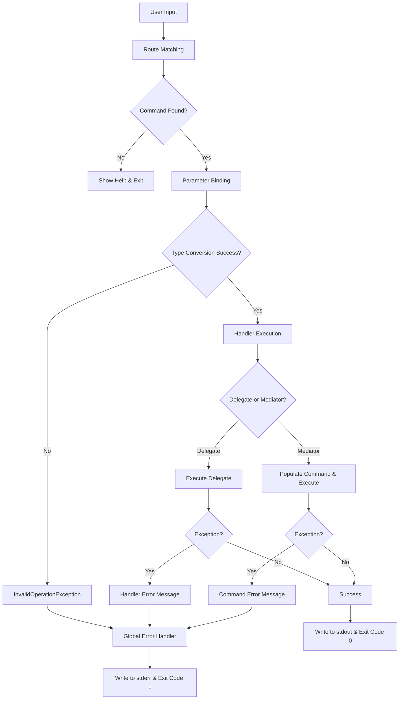

# Error Handling in TimeWarp.Nuru

This document explains how TimeWarp.Nuru handles errors through its multi-layered approach that prioritizes clear error messages and graceful failure while maintaining simplicity.

## Error Handling Architecture



## Key Error Handling Mechanisms

### 1. **Top-Level Exception Handling**
```csharp
catch (Exception ex)
{
    await NuruConsole.WriteErrorLineAsync($"Error: {ex.Message}").ConfigureAwait(false);
    return 1;
}
```
- Catches all unhandled exceptions
- Writes error messages to stderr (separate from normal output)
- Returns exit code 1 to indicate failure

### 2. **Route Parsing Errors**
The `RouteParser` provides comprehensive parsing error handling:
- **ParseResult<T>** with Success/Failure status
- **ParseError** collection with specific error types:
  - `InvalidTypeConstraint` - Unsupported type in `{param:type}` syntax
  - `DuplicateParameterNames` - Same parameter name used twice
  - `UnbalancedBraces` - Missing opening/closing braces
  - `InvalidParameterSyntax` - Wrong parameter format (suggests corrections)
- **Error recovery** with synchronization to continue parsing after errors

### 3. **Parameter Binding Errors**
During parameter extraction and type conversion:
```csharp
throw new InvalidOperationException(
    $"Cannot convert '{stringValue}' to type {param.ParameterType} for parameter '{param.Name}'"
);
```
- Validates required parameters are provided
- Handles type conversion failures with descriptive messages
- Supports optional parameters with default values

### 4. **Type Conversion Errors**
The `TypeConverterRegistry` uses a non-throwing approach:
- **TryConvert()** methods return boolean success indicators
- Supports built-in types: `string`, `int`, `long`, `double`, `decimal`, `bool`, `DateTime`, `Guid`, `TimeSpan`
- Custom converters can be registered for additional types
- Graceful fallback to basic `Convert.ChangeType()` when needed

### 5. **Handler Execution Errors**
Separate error handling for delegate vs Mediator commands:

**Delegate Commands:**
```csharp
catch (Exception ex)
{
    await NuruConsole.WriteErrorLineAsync(
        $"Error executing handler: {ex.Message}"
    ).ConfigureAwait(false);
    return 1;
}
```

**Mediator Commands:**
- Errors during command property population throw `InvalidOperationException`
- Command execution errors bubble up through the Mediator pipeline
- Property setting failures include parameter names and values in error messages

### 6. **Command Matching Errors**
When no route matches the input:
- Returns `ResolverResult` with `Success = false`
- Shows available commands via automatic help generation
- Uses `RouteHelpProvider` to display command usage

### 7. **Output Stream Separation**
- **stdout**: Normal command output and results
- **stderr**: Error messages and diagnostic information
- Prevents error messages from polluting command output
- Enables proper piping and scripting workflows

## Error Handling Philosophy

Nuru follows a **"fail fast with clear messages"** approach:

1. **Simplicity First**: Avoids complex error recovery mechanisms
2. **Clear Communication**: Provides specific, actionable error messages
3. **Graceful Degradation**: Shows help when commands are invalid
4. **Stream Separation**: Keeps errors separate from normal output
5. **Exit Codes**: Uses standard exit codes (0 = success, 1 = error)