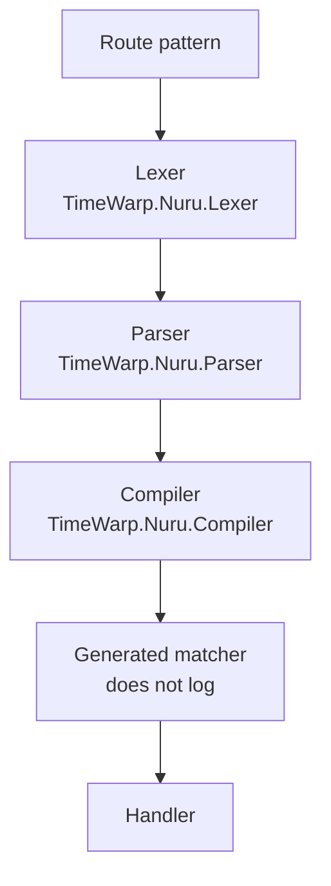

# TimeWarp.Nuru CLI Framework - Comprehensive Debugging Guide

This guide provides detailed information about the extensive debugging and logging capabilities available in TimeWarp.Nuru, going far beyond the basic logging setup in the main Logging documentation.

## Table of Contents

- [🎯 Why Comprehensive Debugging?](#-why-comprehensive-debugging)
- [📋 Debug Message Categories](#-debug-message-categories)
- [🔍 Parser Debugging](#-parser-debugging)
- [🎨 Route Resolution Tracing](#-route-resolution-tracing)
- [⚡ Performance Debugging](#-performance-debugging)
- [🛠️ Common Debug Workflows](#-common-debug-workflows)
- [🔗 Reference Links](#-reference-links)

---

## 🎯 Why Comprehensive Debugging?

`ParsingLoggerMessages` defines many delegates. Only three loggers call any of them. The categories are `TimeWarp.Nuru.Lexer`, `TimeWarp.Nuru.Parser`, and `TimeWarp.Nuru.Compiler`.

- **Lexer**: `StartingLexicalAnalysis` (1050, Trace), `CompletedLexicalAnalysis` (1051, Trace), `DumpingTokens` (1101, Trace)
- **Parser**: `ParsingPattern` (1100, Debug), `DumpingTokens` (1101, Trace), `DumpingAst` (1102, Debug)
- **Compiler**: `SettingBooleanOptionParameter` (1103, Debug)

Registration (1000–1001), command resolution (1200–1210), positional matching (1300–1311), and option processing (1350–1355) are defined and have no callers. There is no `CommandResolver` type and no `TimeWarp.Nuru.Parsing` category. The tables later on this page are that unused catalog. They are not a trace you will see.



The tables below list defined delegates, including ones nothing calls. The basic [logging guide](logging.md) covers the categories that actually log.

---

## 📋 Debug Message Categories

### 🎨 Registration Messages (1000-1099)

Nothing calls events 1000 or 1001. The "when to enable" lines in this catalog describe delegates that are not invoked.

**When to Enable**: During application startup, route configuration issues
**Log Level**: Information/Debug

| Message ID | Level | Description | When It Appears |
|------------|-------|-------------|-----------------|
| 1000 | Info | "Starting route registration" | App startup - before any routes added |
| 1001 | Debug | "Registering route: '{RoutePattern}'" | Each route being registered |

**Example Output:**
```
info: Starting route registration
dbug: Registering route: 'add {x:double} {y:double}'
dbug: Registering route: 'subtract {x:double} {y:double}'
```

### 🎯 Lexer Analysis (1050-1051)
**When to Enable**: Investigate parsing issues, tokenization problems
**Log Level**: Trace

| Message ID | Level | Description |
|------------|-------|-------------|
| 1050 | Trace | "Starting lexical analysis of: '{Input}'" |
| 1051 | Trace | "Lexical analysis complete. Generated {TokenCount} tokens" |

### 📋 Parser Messages (1100-1103)
**When to Enable**: Route pattern parsing issues, AST debugging
**Log Level**: Debug/Trace

#### Parser Control (1100-1101):
| Message ID | Level | Description |
|------------|-------|-------------|
| 1100 | Debug | "Parsing pattern: '{Pattern}'" |
| 1101 | Trace | "Tokens: {Tokens}" |

#### AST Debugging (1102):
| Message ID | Level | Description |
|------------|-------|-------------|
| 1102 | Debug | "AST: {Ast}" |

**Enable AST Dumping:**
```csharp
.UseConsoleLogging(builder => {
    builder.AddFilter("TimeWarp.Nuru.Parser", LogLevel.Debug);  // ParsingPattern (1100) and DumpingAst (1102)
})
```

### 🎪 Command Resolution (1200-1210)
**When to Enable**: Command matching failures, route resolution issues
**Log Level**: Information/Debug/Trace

#### Resolution Control (1200-1201):
| Message ID | Level | Description |
|------------|-------|-------------|
| 1200 | Info | "Resolving command: '{Command}'" |
| 1201 | Debug | "Checking {RouteCount} available routes" |

#### Route Matching (1202-1210):
| Message ID | Level | Description | When It Appears |
|------------|-------|-------------|-----------------|
| 1202 | Trace | "[{Index}/{Total}] Checking route: '{RoutePattern}'" | Each route checked |
| 1203 | Debug | "✓ Matched catch-all route: '{RoutePattern}'" | Catch-all route matched |
| 1204 | Debug | "✓ Matched route: '{RoutePattern}'" | Exact route matched |
| 1205 | Trace | "Route '{RoutePattern}' consumed only {Consumed}/{Total} args" | Partial consumption |
| 1206 | Trace | "Route '{RoutePattern}' failed at option matching" | Option matching failure |
| 1207 | Trace | "Route '{RoutePattern}' failed at positional matching" | Positional failure |
| 1208 | Info | "No matching route found for: '{Command}'" | Complete failure |
| 1209 | Debug | "Extracted values:" | Value extraction start |
| 1210 | Debug | "  {Key} = '{Value}'" | Individual extracted values |

---

## 🔍 Parser Debugging

The parser provides extensive debugging capabilities through multiple components:

### 🎯 Enable Parser Debugging

```csharp
NuruApp app = NuruApp.CreateBuilder()
    .UseConsoleLogging(LogLevel.Trace)  // Enable ALL parser trace messages
    .Map("test {param}")
      .WithHandler((string param) => { })
      .AsCommand()
      .Done()
    .Build();

await app.RunAsync(args);
```

### 📋 Lexer-Level Debugging

**Trace these message patterns** to see tokenization:

```
Trace: Starting lexical analysis of: 'test --verbose'
Trace: Lexical analysis complete. Generated 4 tokens
```

**This reveals:** GeTokenization pattern, syntax validation, character-level processing

### 📊 Parser-Level Debugging

**Control messages** show parsing phases:
```
Debug: Parsing pattern: 'test {param} --verbose'
```

**AST Dumping** shows complete syntax tree:
```
Debug: AST: Parameter(name=param, isOptional=false) -> Option(longForm=verbose, expectsValue=false)
```

### 🔄 Route Compilation Debugging

Enables deep parser inspection:
```csharp
// Enable full parser debugging
.UseConsoleLogging(builder => {
    builder.AddFilter("TimeWarp.Nuru.Parser", LogLevel.Debug)
           .AddFilter("TimeWarp.Nuru.Lexer", LogLevel.Trace)
           .AddFilter("TimeWarp.Nuru.Compiler", LogLevel.Debug);
})
```

**What this shows:**
- Pattern tokenization (Lexer)
- AST construction (Parser)
- Route compilation (Compiler)
- Syntax validation reporting

---

## 🎨 Route Resolution Tracing

The most detailed debugging category with **12 trace message types** for parameter matching:

### 📋 Positional Matching Messages (1300-1311)

#### Matching Control (1300):
| ID | Message | Description |
|----|---------|-------------|
| 1300 | "Matching {SegmentCount} positional segments against {ArgumentCount} arguments" | Matching initialization |

#### Catch-All Processing (1301-1302):
| ID | Message | Description |
|----|---------|-------------|
| 1301 | "Catch-all parameter '{ParameterName}' captured: '{Value}'" | Catch-all succeeded |
| 1302 | "Catch-all parameter '{ParameterName}' has no args to consume" | Catch-all failed |

#### Optional Parameter Handling (1303-1305):
| ID | Message | Description |
|----|---------|-------------|
| 1303 | "Optional parameter '{ParameterName}' - no value provided" | Optional skipped |
| 1304 | "Not enough arguments for segment '{Segment}'" | Under-consumption |
| 1305 | "Optional parameter skipped - hit option '{Option}'" | Option boundary |

#### Argument Processing (1307-1311):
| ID | Message | Description |
|----|---------|-------------|
| 1307-1308 | "Attempting to match {Argument} against {Segment}" & Failures | Individual argument processing |
| 1309 | "Extracted parameter '{ParameterName}' = '{Value}'" | Successful extraction |
| 1310 | "Literal '{Literal}' matched" | Literal segment matching |
| 1311 | "Positional matching complete. Consumed {Count} arguments" | Phase completion |

### 📊 Option Processing Messages (1350-1352)

| ID | Message | Description |
|----|---------|-------------|
| 1350 | "Boolean option '{OptionName}' = true" | Boolean option found |
| 1351 | "Required option not found: {Option}" | Missing required option |
| 1352 | "Options matching complete. Consumed {ConsumedCount} args" | Phase completion |

---

## ⚡ Performance Debugging

### 🔍 Control Flow Analysis

**Step-by-step route resolution** with trace logging:

1. **Preparation Phase** (Message 1200-1201):
   ```
   Info: Resolving command: 'deploy prod --force'
   Debug: Checking 5 available routes
   ```

2. **Matching Phase** (Messages 1202-1207):
   ```
   Trace: [1/5] Checking route: 'deploy {env}'
   Trace: [2/5] Checking route: 'deploy {env} --force'
   Debug: ✓ Matched route: 'deploy {env} --force'
   ```

3. **Value Extraction** (Messages 1210):
   ```
   Debug: Extracted values:
   Debug:   env = 'prod'
   Debug:   force = 'true'
   ```

### 📈 Optimization Identification

**Performance Issues Identified Through Logging:**

- **Slow Route Matching**: High trace message volume at certain routes
- **Type Conversion Delays**: Long gaps in parameter binding traces
- **Cancellation Issues**: Repeated matching attempts

### 🎯 Benchmark Integration

The debugging system works alongside [benchmarking](./TimeWarp.Nuru.Benchmarks/):

```csharp
// Debug specific route performance
.UseConsoleLogging(builder => {
    builder.AddFilter("TimeWarp.Nuru.Parser", LogLevel.Debug)
           .AddFilter("TimeWarp.Nuru.Lexer", LogLevel.Trace);
})

// Combined with benchmark timing for performance debugging
[Benchmark(Description = "Complex routing with trace logging")]
public void BenchmarkWithDebugging() { /* ... */ }
```

---

## 🛠️ Common Debug Workflows

### 🐛 Routing Issues

**Problem:** Command not matching expected route

**Debug Steps:**
1. Enable route resolution tracing
2. Check consumption ratios
3. Verify parameter extraction

```csharp
// Pattern parsing. Route matching itself does not log.
.UseConsoleLogging(builder => {
    builder.AddFilter("TimeWarp.Nuru.Parser", LogLevel.Debug)
           .AddFilter("TimeWarp.Nuru.Lexer", LogLevel.Trace);
})
```

The sample below is the text of delegates that nothing calls. You will not see it.

**Defined, not emitted:**
```
Trace: [1/3] Checking route: 'deploy {env}'          // Route being checked
Trace: Matching 2 segments against 2 arguments       // Consumption setup
Trace: Literal 'deploy' matched                       // Successful literal
Trace: Attempting to match 'prod' against {env}      // Parameter matching
Trace: Extracted parameter 'env' = 'prod'            // Successful extraction
Debug: ✓ Matched route: 'deploy {env}'               // Final success
```

### 🔍 Parameter Binding Issues

**Problem:** Parameters not extracted correctly

**Debug Steps:**
1. Enable extraction tracing (Message 1210)
2. Check conversion failures
3. Verify argument consumption

### 📊 Performance Bottlenecks

**Problem:** Slow CLI startup or command execution

**Debug Steps:**
1. Enable timing traces
2. Profile route matching duration
3. Identify conversion bottlenecks

---

## 🔗 Reference Links

### 📚 Documentation
- **[Basic Logging Setup](Logging.md)** - Fundamental logging configuration
- **[Route Pattern Syntax](RoutePatternSyntax.md)** - Pattern debugging examples
- **[Glossary](Glossary.md)** - Terminology definitions

### 🎯 Community Feedback
This debugging system was shaped by **community feedback analysis** in:

- **[Community Feedback System](../../analysis/Community-Feedback/)** - Structured feedback processing
- **[API Feedback Analysis](../../community-feedback/001-api-naming-error-handling/)** - Debugger improvements from user feedback
- **[Roslyn Analyzers](../../community-feedback/001-api-naming-error-handling/)** - Compilation-time debugging

### 🪲 Implementation Details
- **[Logger Message Definitions](../../../source/timewarp-nuru-parsing/logging/logger-message-definitions.cs)** - Message catalog. Parser, lexer, and compiler call a subset of these.
- **[Nuru Logging Extensions](../../../source/timewarp-nuru/logging/nuru-logging-extensions.cs)** - Logging configuration API

### 🔧 Testing
- **[Analyzer Test Cases](../../Tests/TimeWarp.Nuru.Analyzers.Tests/TestSamples.cs)** - Diagnostic test scenarios

---

## 📝 Notes

- **Trace Level Required**: Most detailed debugging messages require `LogLevel.Trace`
- **Performance Impact**: Trace-level logging affects performance - use sparingly
- **AST Dumping**: Message 1102 provides complete syntax tree visualization
- **Resolver Tracing**: Messages 1300-1352 provide complete route matching detail
- **Community Feedback**: Debugging capabilities improved based on user feedback documented in analysis/Community-Feedback/

These extensive debugging capabilities transform TimeWarp.Nuru from a CLI framework into a **diagnostic powerhouse**, enabling developers to trace every aspect of command processing and routing decisions.

For specific debugging scenarios, refer to the [Community Feedback Analysis](../../analysis/Community-Feedback/) to see how user-reported issues influenced debugging feature development.