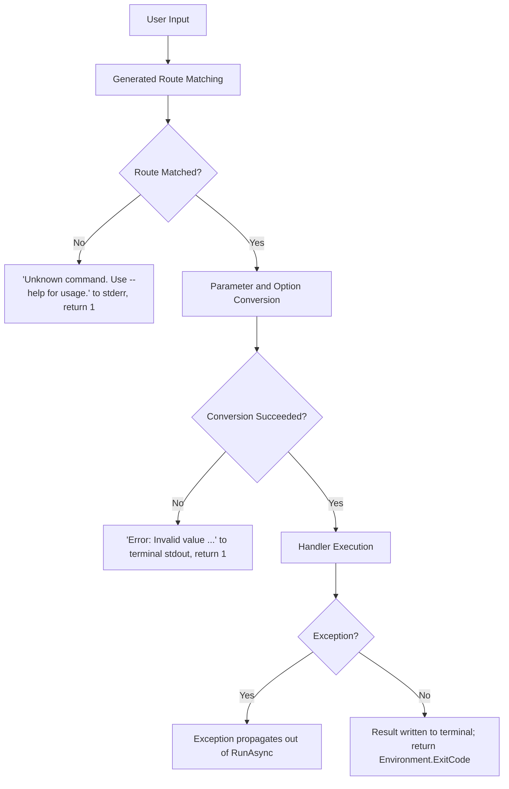

# Error Handling in TimeWarp.Nuru

Documentation of the error handling behavior of the generated code in TimeWarp.Nuru 3.0.

`NuruApp.RunAsync(args)` is replaced at compile time by a source-generated interceptor. All behavior below
describes what that generated code does.

## Error Handling Architecture


```mermaid
graph TD
    A[User Input] --> B[Generated Route Matching]
    B --> C{Route Matched?}
    C -->|No| D["'Unknown command. Use --help for usage.' to stderr, return 1"]
    C -->|Yes| E[Parameter and Option Conversion]
    E --> F{Conversion Succeeded?}
    F -->|No| G["'Error: Invalid value ...' to terminal stdout, return 1"]
    F -->|Yes| H[Handler Execution]
    H --> I{Exception?}
    I -->|Yes| J[Exception propagates out of RunAsync]
    I -->|No| K[Result written to terminal; return Environment.ExitCode]
```

## Key Error Handling Mechanisms

### 1. **Handler Exceptions Are Not Caught**

Generated code does not wrap handler invocation in a catch block. If a handler throws, the exception
propagates out of `RunAsync` to the caller. When telemetry is enabled, the generated code records the
exception type on the activity and metrics and then rethrows (`throw;`); it does not swallow it.

There is no framework-written `Error executing handler` message and no automatic exit code `1` for
handler exceptions. If you want a friendly message and a non-zero exit code, handle the exception yourself,
either inside the handler or around `RunAsync`:

```csharp
NuruApp app = NuruApp.CreateBuilder()
  .Map("process {file}")
    .WithHandler((string file, ITerminal terminal) =>
    {
      try
      {
        ProcessFile(file);
        terminal.WriteLine($"Processed {file}");
      }
      catch (IOException ex)
      {
        terminal.WriteErrorLine($"Error: {ex.Message}");
        Environment.ExitCode = 1;
      }
    })
    .AsCommand()
    .Done()
  .Build();

return await app.RunAsync(args);
```

Or catch at the call site:

```csharp
try
{
  return await app.RunAsync(args);
}
catch (Exception ex)
{
  Console.Error.WriteLine($"Error: {ex.Message}");
  return 1;
}
```

### 2. **Exit Codes and Handler Return Values**

Per the `NuruApp.RunAsync` documentation, handler return values are written to the terminal as output;
they do **not** control the exit code. For example, `.WithHandler(() => 42)` prints `42` and the process
still exits with `0`. The generated code ends each matched route with `return Environment.ExitCode;`, so
to signal failure from a handler, set `Environment.ExitCode`:

```csharp
.Map("check")
  .WithHandler(() =>
  {
    Environment.ExitCode = 1;
  })
  .AsCommand()
  .Done()
```

Generated binding and no-match errors (below) return `1` directly.

**Key principles:**
- Handler output is written through the terminal (`app.Terminal`), not via a returned exit code.
- A non-zero exit code from a handler requires setting `Environment.ExitCode`.
- Exit codes: `0` = success, `1` = generated binding or no-match failure.

### 3. **Route Parsing Errors**
Route patterns are parsed by the source generator at compile time, so malformed patterns are reported as
build diagnostics rather than runtime errors. Examples include unsupported `{param:type}` constraints,
duplicate parameter names, unbalanced braces and invalid parameter syntax.

### 4. **Parameter and Option Binding Errors**
After a route matches, the generated code converts string arguments to the declared parameter types.
It uses `TryParse()`-style conversion for built-in types (`int`, `long`, `double`, `decimal`, `bool`,
`DateTime`, `Guid`, `TimeSpan`, and so on), `Uri.TryCreate` for `Uri`, constructor calls with a
`try`/`catch` for `FileInfo` and `DirectoryInfo`, and the registered `TryConvert()` for enums and custom
converters.

On conversion failure the generated code:
- writes one line to `app.Terminal.WriteLine(...)` (the terminal's **standard output**, not
  standard error), and
- returns exit code `1` immediately.

It does **not** throw an exception and does **not** try the next route.

Messages emitted by the generator:

| Case | Message |
|------|---------|
| Scalar parameter (built-in type) | `Error: Invalid value 'abc' for parameter 'port'. Expected: int` |
| Typed catch-all parameter | `Error: Invalid value in 'args'. Expected: int[]` |
| Repeated or typed option | `Error: Invalid value in option '--ids'. Expected: int` |
| Scalar option | `Error: Invalid value 'abc' for option '--port'. Expected: int` |
| Enum parameter or option | `Error: Invalid value 'x' for parameter 'env'. <valid values message>` |
| Custom converter parameter | `Error: Invalid <Type> value for parameter 'name': 'x'` |
| Option missing a `FileInfo`/`DirectoryInfo` value | `Error: Missing value for option '--file'. Expected: FileInfo` |

**Design Decision:** Type conversion failures are binding errors, not matching failures. When a user types
`server --port abc` and a route exists for `server --port {num:int}`, the route **matched** but the
**binding failed**. The user gets a clear error, not a confusing "unknown command" message from fallback
behavior.

Note: binding errors currently go to the terminal's standard output.

### 5. **Command Matching Errors**
When no route matches the input, the generated fallback writes
`Unknown command. Use --help for usage.` to the terminal's **standard error**
(`WriteErrorLineAsync`) and returns exit code `1`.

### 6. **Output Stream Usage**
- **Handler results**: written to `app.Terminal` (standard output). `void`/`Task`/`Unit` results produce
  no output; primitives are written as text, dates as ISO 8601, and complex types as JSON.
- **Binding errors**: `app.Terminal.WriteLine` (standard output, currently).
- **No-match error**: `app.Terminal.WriteErrorLineAsync` (standard error).
- Handlers that need to write errors to standard error should use
  `ITerminal.WriteErrorLine` / `WriteErrorLineAsync`.

## Implementation Details

- Matched routes return `Environment.ExitCode` (default `0`); binding and no-match failures return `1`.
- Handler exceptions are not caught by generated code and propagate to the caller of `RunAsync`.
- Binding errors name the parameter or option and the offending value.
